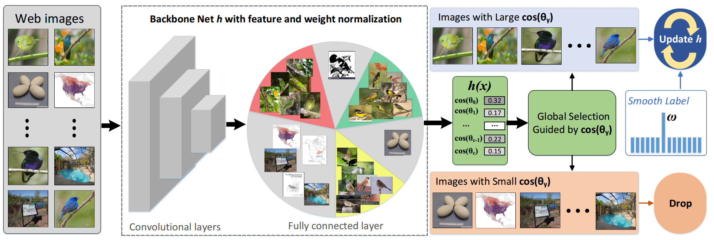
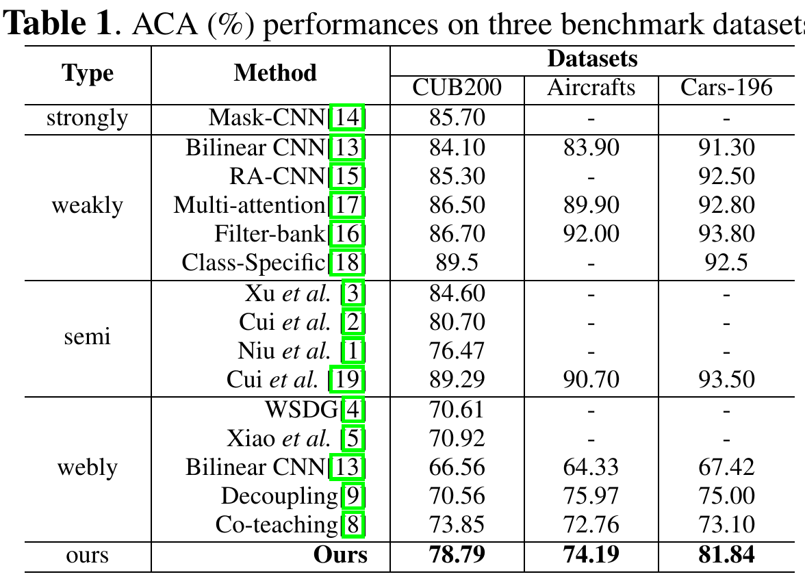

# Web-Supervised Network for Fine-Grained Visual Classification

Introduction
------------
This is the source code for our paper **Web-Supervised Network for Fine-Grained Visual Classification**

Network Architecture
--------------------
The architecture of our proposed model is as follows


Installation
------------
After creating a virtual environment of python 3.7, run `pip install -r requirements.txt` to install all dependencies

How to use
------------
The code is currently tested only on GPU
* **Data Preparation**
    - Download data into project root directory and uncompress them using
        ```
        wget https://wsnfg.oss-cn-hongkong.aliyuncs.com/web-bird.tar.gz
        wget https://wsnfg.oss-cn-hongkong.aliyuncs.com/web-car.tar.gz
        wget https://wsnfg.oss-cn-hongkong.aliyuncs.com/web-aircraft.tar.gz
        tar -xvf web-bird.tar.gz
        tar -xvf web-car.tar.gz
        tar -xvf aircraft-car.tar.gz
        ```
* **Demo**
    - If you want to quickly test the performance, please follow subsequent steps
    
      - Download model using
       ```
        wget https://smoothlearning.oss-cn-hongkong.aliyuncs.com/resnet50_81.pth
       ```
    
      - Choose a dataset, create soft link to dataset by
       ```
       ln -s web-bird bird
       ```  
      
       - Modify `CUDA_VISIBLE_DEVICES` to proper cuda device id in  ``` run_demo.sh```
       
       - Activate virtual environment(e.g. conda) and then run the script
       ```
       bash run_demo.sh
       ```

* **Source Code**

    - If you want to train the whole network from begining using source code on the web fine-grained dataset, please follow subsequent steps
    
      - Choose a dataset, create soft link to dataset by
       ```
       ln -s web-bird bird
       ln -s web-car car
       ln -s web-aircraft aircraft
       ```  
      - Modify `CUDA_VISIBLE_DEVICES` to proper cuda device id in  ``` run_train_resnet.sh```
      - Modify `data` to the dataset you want to use in  ``` run_train_resnet.sh```
      
      - Activate virtual environment(e.g. conda) and then run the script
       ```
       bash run_train_resnet.sh
       ```
    - We recommend you use Resnet model, because it's easier to train. Resnet-18 shows similar performance with BCNN but needs much less time to train. Resnet-50 has better performance. If you want to train the BCNN model, use ``` run_train_bcnn.sh```. 
    
    

## Citation

If you find this useful in your research, please consider citing:

    @inproceedings{zhang2020web,
	title={Web-Supervised Network for Fine-Grained Visual Classification},
	author={Chuanyi Zhang, Yazhou Yao, Jiachao Zhang, Jiaxin Chen, Pu Huang, Jian Zhang, Zhenmin Tang},
	booktitle={IEEE International Conference on Multimedia and Expo (ICME)},
	year={2020}
	}
